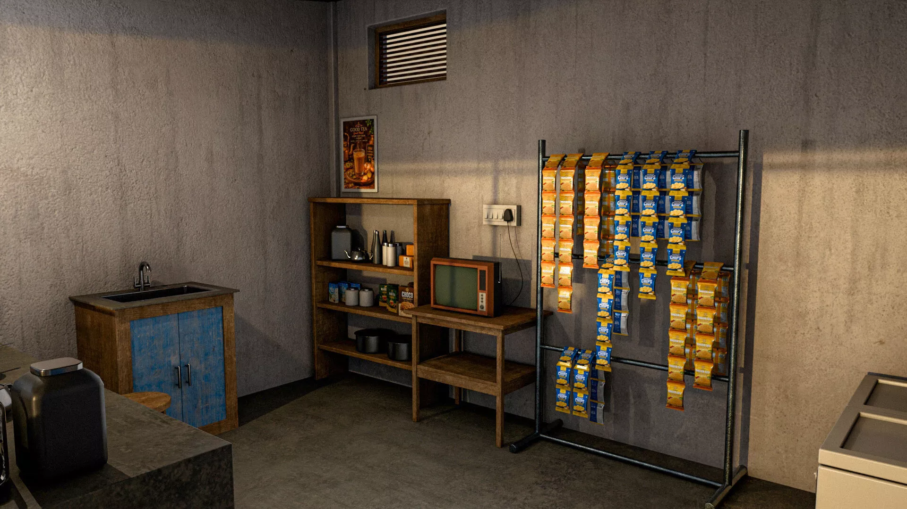
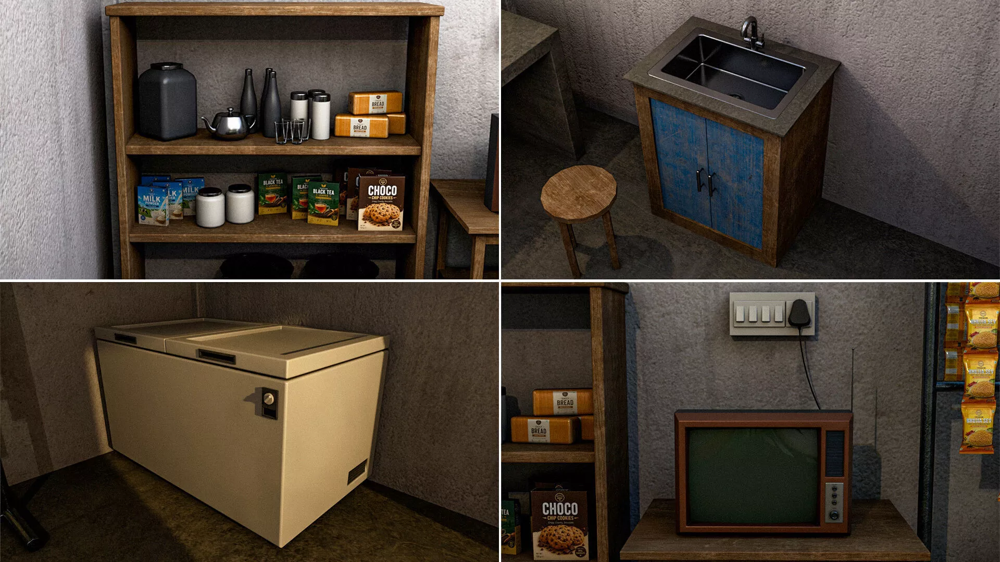
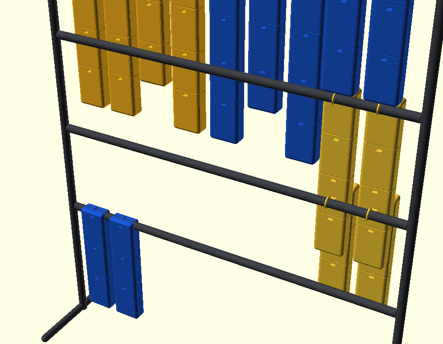

# 🍵 TeaKadai_MLO

> A parametric **OpenSCAD kit-of-parts** for a countryside **tea kadai** (tea shop) —
> modeled part-by-part, exported to STL, assembled in **Blender**, and prepared as a
> **GTA V MLO** interior.



[](LICENSE)
[](components/)
[](blender/)
[](#-gta-v-mlo-workflow)
[](#-getting-started)

---

## ✨ What's inside

- **Kit-of-parts architecture** — every wall, roof piece, beam and prop is an
  independent, parametric OpenSCAD part, assembled by a dedicated `*_assemble.scad`
  file. Swap, resize or re-export any single part without touching the rest.
- **Dual-scale STL exports** — meshes in millimetres (3D printing / generic CAD)
  and, for the vanity, a PowerShell batch exporter that also emits metre-scaled
  STLs (GTA V uses 1 unit = 1 m).
- **Blender master scene** — `blender/TeaKadai_V1.blend` holds the textured,
  dressed interior shown above (shelves, props, TV, snack rack…).
- **Game-ready workflow** — documented path from OpenSCAD → STL → Blender →
  GIMS EV / Sollumz → `.ydr` / `.ytd` / `.ybn` for an MLO interior.

## 📁 Repository structure

```text
TeaKadai_MLO/
├── components/                    # 6 parametric model folders (56 files)
│   ├── 01_base_shell/             # floor slab, walls, front piers + sill, assembly
│   ├── 02_roof/                   # roof slab, tiles, ridge cap, eave fascias, assembly
│   ├── 03_pergola/                # posts, main/cross beams, braces, slats, assembly
│   ├── 04_chips_rack/             # snack display rack + render previews
│   ├── 05_chest_freezer/          # chest freezer + render previews
│   └── 06_handwash_vanity/        # washbasin vanity + batch STL export script
├── blender/
│   └── TeaKadai_V1.blend          # Blender master scene (textured interior)
├── references/                    # 16 reference / concept renders → gallery index
├── docs/                          # full design document (PDF) — next backup stage
├── LICENSE
└── README.md
```

## 🧩 Components

| # | Folder | What it contains | Highlights |
|---|--------|------------------|------------|
| 01 | [`01_base_shell`](components/01_base_shell) | Floor slab, back wall, both side walls, front-wall piers + sill, full assembly | `tea_shop_assemble.scad` puts the shell together; shared `tea_shop_parameters.scad` drives every dimension |
| 02 | [`02_roof`](components/02_roof) | Roof slab, tile layout, ridge cap, 3 × eave fascias, full assembly | `part_roof_complete.scad` previews the finished roof; own parameter/module files |
| 03 | [`03_pergola`](components/03_pergola) | 5 pergola parts (posts, main beam, cross beams, diagonal brace, slats), each with its own STL, plus assembly | Every part is pre-exported and pre-aligned at its real position |
| 04 | [`04_chips_rack`](components/04_chips_rack) | Wall-standing snack/chips display rack | Iso + front render previews included |
| 05 | [`05_chest_freezer`](components/05_chest_freezer) | Corner chest freezer with grip + vents | Iteration and close-up renders document the design |
| 06 | [`06_handwash_vanity`](components/06_handwash_vanity) | Rustic washbasin vanity (blue doors, concrete top, gooseneck tap) | Includes [`export_stls.ps1`](components/06_handwash_vanity/export_stls.ps1) batch exporter (mm **and** GTA metres) and a detailed [component README](components/06_handwash_vanity/README.md) |

## 🚀 Getting started

**Prerequisites**

- [OpenSCAD](https://openscad.org/) 2019.05+ (for rendering / re-exporting parts)
- [Blender](https://www.blender.org/) 3.x+ (for assembly, texturing, MLO export)

**Render & export a part**

1. Open any `part_*.scad` or the `*_assemble.scad` file in OpenSCAD.
2. Tweak dimensions in the **Customizer** (Window → Customizer).
3. `F6` to render, then `File → Export → STL/OBJ`.

**Batch export (vanity example)**

```powershell
cd components\06_handwash_vanity
.\export_stls.ps1
```

Writes every part twice: `stl\` (millimetres) and `stl_meters\` (GTA scale).

## 🎮 GTA V MLO workflow

1. Import the metre-scaled STLs into **Blender** — parts arrive pre-aligned;
   no repositioning needed. (Or import mm meshes and scale ×0.001.)
2. Set each openable door's origin at its hinge edge (**Object → Set Origin**).
3. UV-unwrap and texture (STL carries no UVs).
4. Use **GIMS EV** or **Sollumz** to create the `.ydr` drawable + `.ytd` textures,
   and simple box collision (`.ybn`) for the carcass/countertop.
5. Keep it game-friendly: lower the `quality` parameter before exporting, or
   decimate in Blender — final meshes stay in the low thousands of tris.

> 📝 The full step-by-step (with the vanity as the worked example) is in
> [`components/06_handwash_vanity/README.md`](components/06_handwash_vanity/README.md).

## 🖼️ Gallery

| Pantry & props | Vanity · Freezer · TV |
|---|---|
|  |  |

Browse all 16 reference/concept renders in the
[`references/`](references/) gallery index.

## 📄 Documentation

The complete design document (every part, dimension and export note) will be
published under `docs/` in the next backup stage.

## 📜 License

Released under the [MIT License](LICENSE) — free to use, modify and build upon.
