# 🖼️ Reference Gallery

Concept / reference renders used while modeling the tea kadai —
walls, props, furniture and the dressed interior of `blender/TeaKadai_V1.blend`.

| | |
|---|---|
| 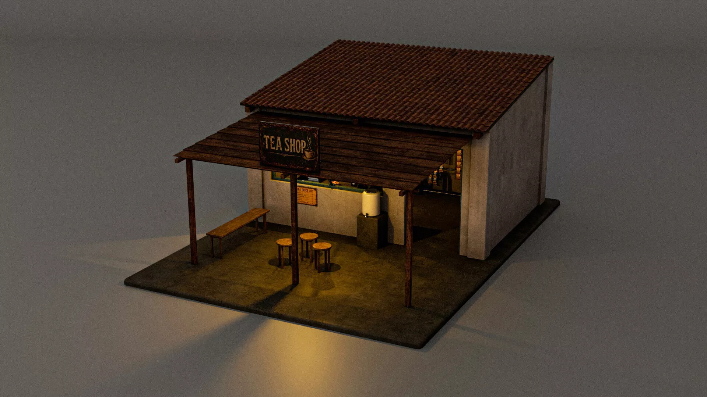 | 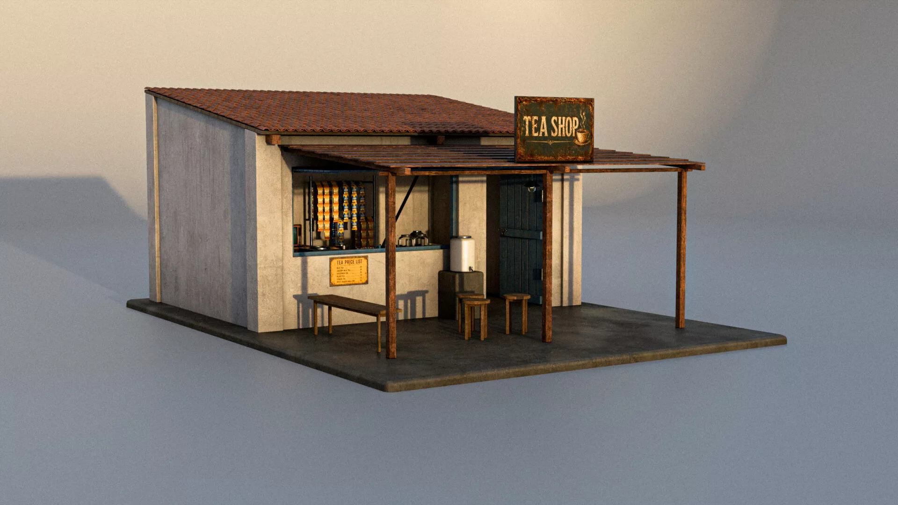 |
| *01 — reference render* | *02 — reference render* |
| 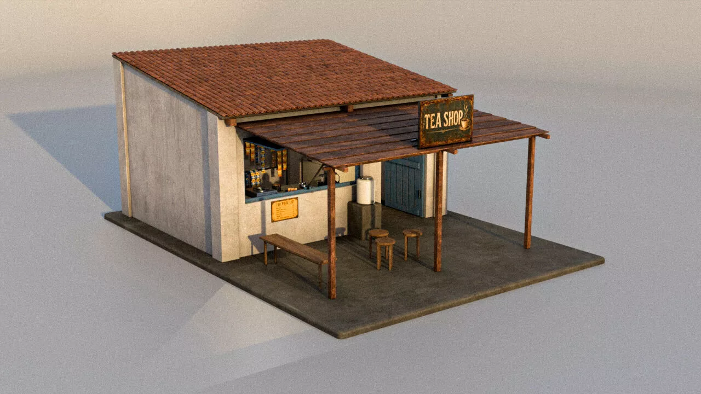 |  |
| *03 — reference render* | *04 — dressed interior (README hero)* |
| 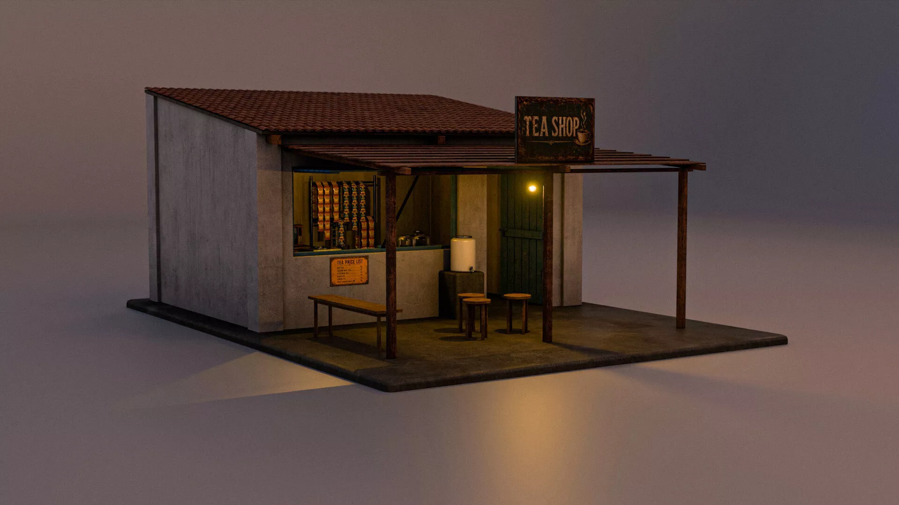 | 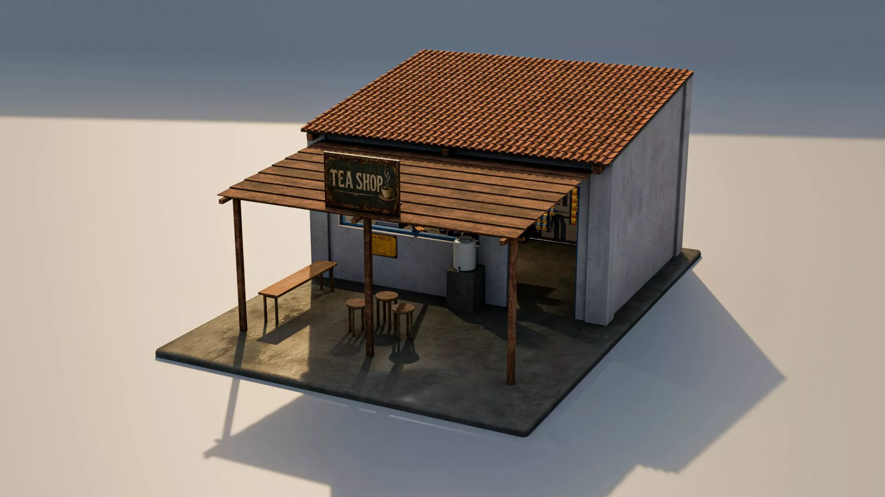 |
| *05 — reference render* | *06 — reference render* |
| 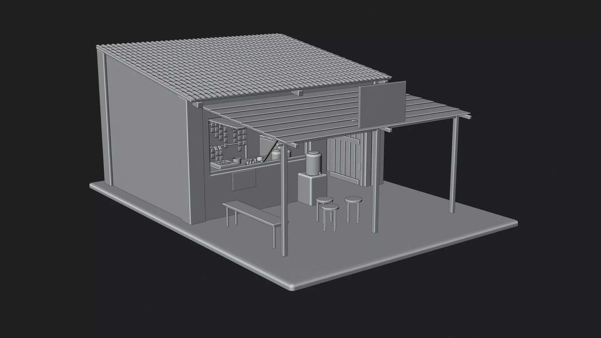 | 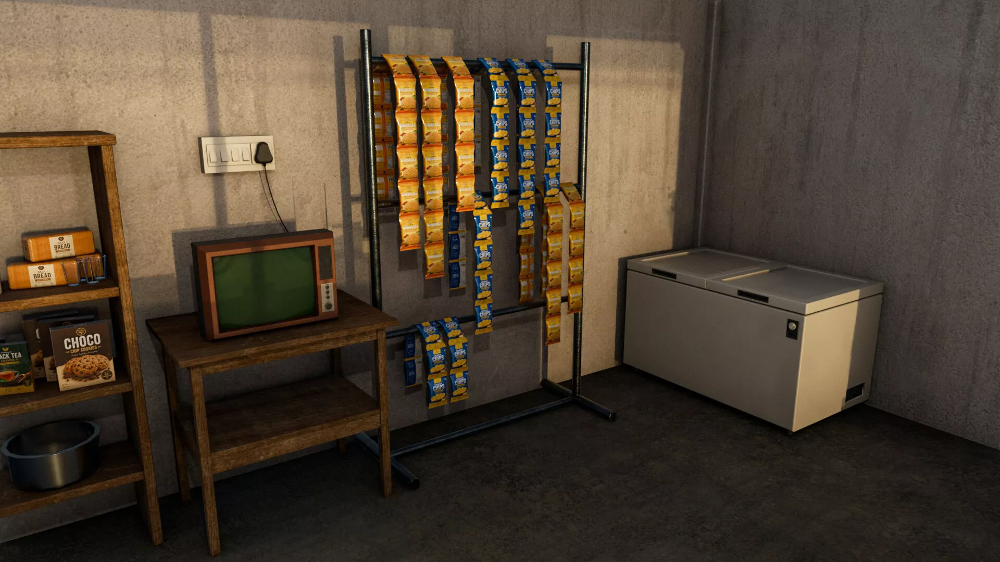 |
| *07 — reference render* | *08 — reference render* |
| 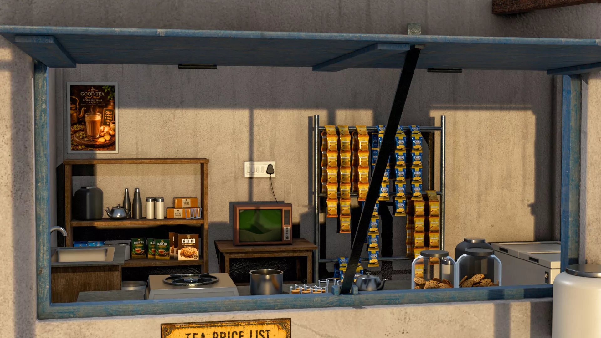 | 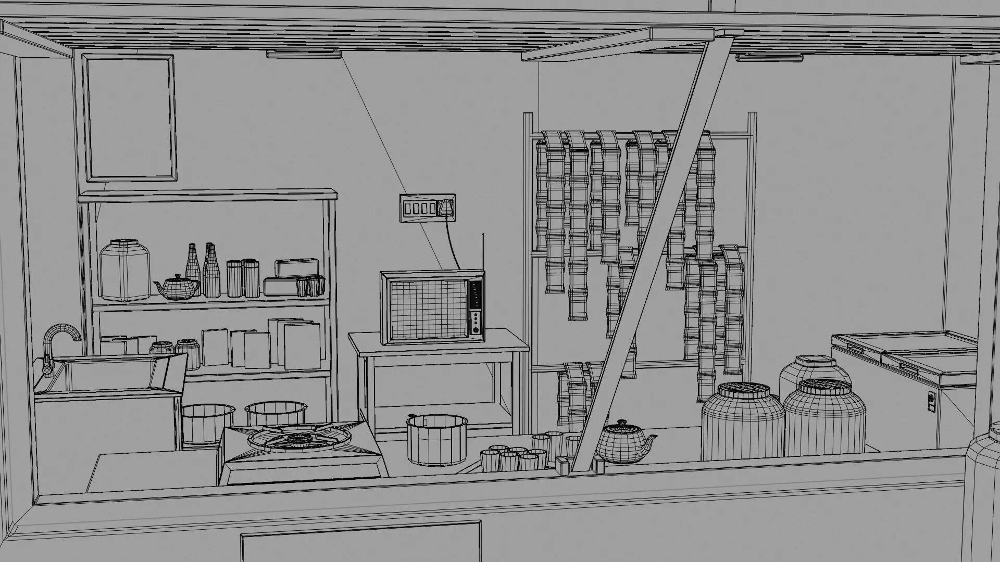 |
| *09 — reference render* | *10 — reference render* |
| 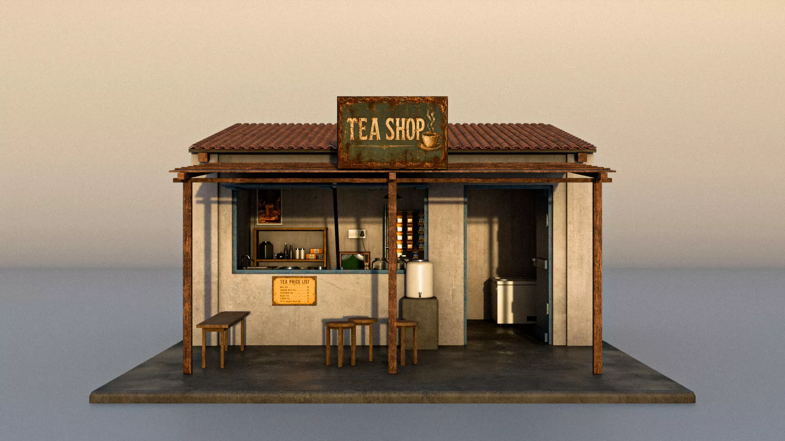 | 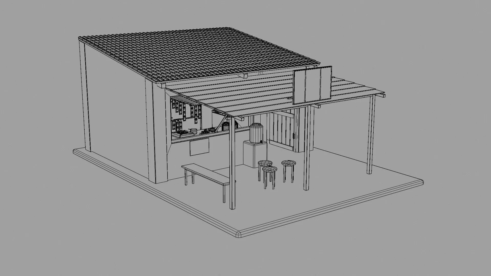 |
| *11 — reference render* | *12 — reference render* |
|  | 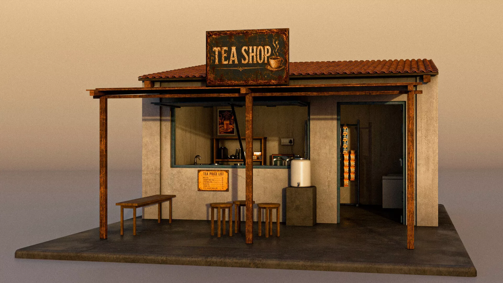 |
| *13 — component close-up grid* | *14 — reference render* |
| 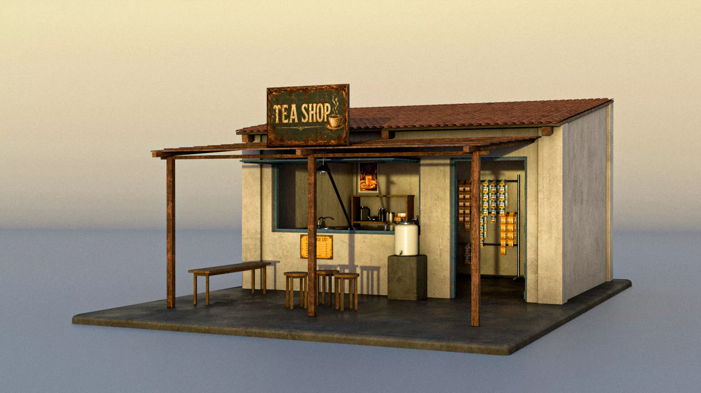 | 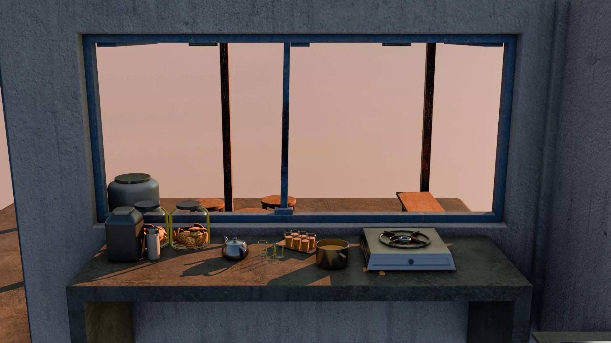 |
| *15 — reference render* | *16 — reference render* |

---

Back to the [main README](../README.md).
